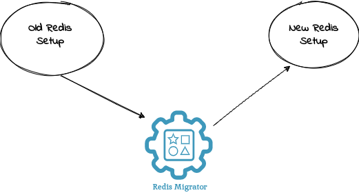

  

Redis migrator is a golang based tool to migrate the database keys from one redis cluster to another. This tool can be used to migrate different types of redis keys from one redis setup to another.

Redis supported keys:-

- String keys
- Hash keys

